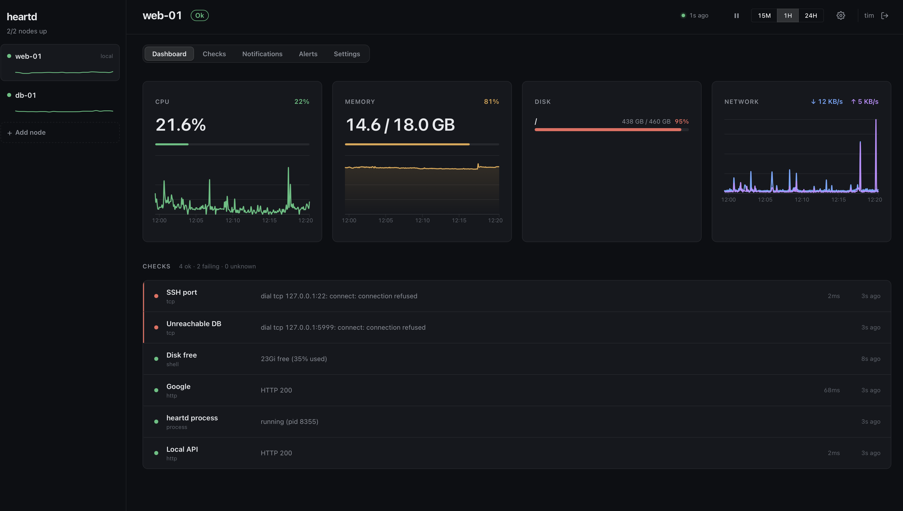

# heartd

A lightweight, self-hosted server health monitor. One static binary, one YAML
file, a clean web dashboard. Installable in under two minutes on any Linux or
macOS server.

heartd gives small teams an honest answer to *"is everything okay?"* — system
resources, service checks, and the reachability of every node in a small cluster
— without the weight of a full observability platform.



## Features

- **System metrics** — CPU, memory, disk (per mount), and network throughput,
  sampled on an interval and stored in an embedded SQLite database with a rolling
  retention window. Current value + time-series charts in the dashboard.
- **Service checks** — `http`, `tcp`, `process`, and `shell` checks, each on its
  own schedule, with status, detail, and latency.
- **Dynamic alerts** — build as many alert rules as you like across nine trigger
  types (CPU/memory/disk %, check failing, check latency, network in/out, node
  unreachable, no-data). Each rule has a `warning`/`critical` severity, an
  optional sustained-duration (*fire only after N seconds*), and an anti-flap
  recovery grace. Delivered over email (SMTP) and/or webhook (POST JSON).
- **Multi-node** — point nodes at each other; every node's dashboard shows the
  whole cluster (metrics + checks for each node) and flags any node that goes
  down. Add and remove nodes live from the sidebar. Node-to-node auth is a shared
  secret; nodes only need HTTP reachability, not a shared network.
- **Live configuration** — checks, alerts, notification channels, sampling
  cadence, retention, peers, and user accounts are all edited **in the dashboard**
  and applied **without a restart**. The YAML file only seeds first-run defaults.
- **Built-in auth** — a first-run "create admin" flow, session cookies, and a
  user-management screen. Every account is a full admin.
- **Embedded dashboard** — a React UI served by the binary itself. No separate
  frontend deployment, no Node runtime in production, no reverse proxy required.

## Quick start

One line on any Linux box. It downloads the binary, creates a **hardened systemd
service** bound to `127.0.0.1`, and starts it (so it survives reboots):

```sh
curl -fsSL https://raw.githubusercontent.com/timanthonyalexander/heartd/main/install.sh | sudo bash
```

Then open <http://localhost:9300> — or put it behind your reverse proxy, see
[Deployment](#deployment-linux) — and create the first admin account. With no
config, heartd runs on sensible defaults (local node, 30s sampling, the default
alert rules); everything else is configured in the dashboard.

Building from source instead? See [Building](#building).

Flags:

```
-config <path>   path to heartd.yaml (default: ./heartd.yaml)
-addr <addr>     listen address override, e.g. 127.0.0.1:9300 (default: from config port)
```

## Configuration

heartd has **two configuration layers**:

1. **`heartd.yaml`** — node *identity and topology* that isn't runtime-editable:
   the node `name`, `port`, `db_path`, and `advertise_url`. On **first run only**,
   the rest of the file (sampling interval, retention, alert thresholds, checks,
   notify channels, peers) is used to *seed* the database. See
   [`heartd.example.yaml`](./heartd.example.yaml) for a fully-documented reference.

2. **The dashboard** — everything operational is edited live and applied without a
   restart. After the first run, the YAML's `thresholds` / `checks` / `notify` /
   `peers` sections are ignored (the database is the source of truth), so deleting
   something in the UI sticks across restarts.

| YAML section | Role |
|---|---|
| `server` | node name, port, db path, `advertise_url`, `peer_poll_interval`, **first-run** sampling interval + retention |
| `thresholds` | **first-run** seed for the default CPU / memory / disk alert rules |
| `peers` | **first-run** seed of the peer list (managed live thereafter) |
| `checks` | **first-run** seed of service checks (managed live thereafter) |
| `notify` | **first-run** seed of email/webhook channels (managed live thereafter) |

Durations accept Go units plus a `d` (days) suffix: `30s`, `5m`, `1h`, `7d`.

### In the dashboard

Each node has its own tabs:

- **Dashboard** — live metrics, disk, network, and check status.
- **Checks** — create/edit/delete service checks (`http` / `tcp` / `process` / `shell`).
- **Notifications** — email + webhook channels, with a "send test" button.
- **Alerts** — the alert rules for this node (see [Alerting](#alerting)).
- **Settings** — sampling interval, peer-poll interval, and retention.

Editing a **remote node's** tabs proxies the change to that node over the
shared-secret peer link, so each node owns its own config but is manageable from
anywhere. **Nodes** are added/edited/removed from the sidebar. **Users** are
managed on the global Settings page (the gear icon).

## Authentication

The dashboard and its API require a login. On first launch heartd is
*uninitialized* — the dashboard prompts you to **create the first admin account**.
After that, every data endpoint returns `401` until you sign in; sessions are
HttpOnly cookies stored server-side in SQLite. Every user is an admin, and you can
add/remove users and change passwords from the Settings page (the last remaining
user can't be deleted).

Node-to-node traffic (`/api/peer/*`) is authenticated separately by the per-peer
shared secret, not by user login, so clustering works without any accounts on the
peer. `GET /api/health` stays public as a liveness probe (it returns no data).

heartd serves plain HTTP; put it behind a TLS-terminating reverse proxy if the
port is reachable from untrusted networks.

## Multi-node

Add a peer from the sidebar (**+ Add node**) with its name, URL, and a shared
`secret` — use the **same secret on both ends of a link**. Peers can also be
seeded from `peers:` in `heartd.yaml` on first run. On startup a node announces
itself to its peers (`advertise_url` tells them how to reach it back) and then
polls each peer on `peer_poll_interval`, fetching their metrics and checks and
recording reachability. The result: every node's dashboard is a full cluster view,
and any node can alert on any other going down (a dead node is reported by a live
one).

Nodes communicate over plain HTTP. There is no TLS (out of scope); for traffic
crossing untrusted networks, front each node with a TLS-terminating reverse proxy
and use `https://` peer URLs, or run them over a private network / VPN.

## Alerting

Alerts are **rules**, configured per node on the **Alerts** tab. Each rule watches
one source and fires when its condition holds:

| Source | Condition | Unit |
|---|---|---|
| CPU / Memory usage | `> / >= / < / <=` a threshold | percent |
| Disk usage | per mount (or any) crosses a threshold | percent |
| Service check failing | a named check (or any) is failing | — |
| Service check latency | a check's latency crosses a threshold | ms |
| Network in / out | throughput crosses a threshold | MB/s |
| Node unreachable | a peer (or any) is down | — |
| No data | a peer's samples are older than a threshold | seconds |

Every rule carries a **severity** (`warning` / `critical`), an optional **fire
after** (the condition must hold continuously for N seconds before it alerts — a
brief spike is ignored), and a **recovery grace** (stay firing briefly after
recovery, to damp flapping). Want both a warning and a critical level? Make two
rules.

Alerts are **edge-triggered and de-duplicated**: one notification when a problem
begins, one when it recovers, never repeated for an ongoing failure — and a
restart does not re-alert an already-firing rule. Delivery is non-blocking over
the channels configured on the **Notifications** tab.

The three legacy CPU/memory/disk thresholds are migrated to default rules on
first run, so existing installs keep working and the defaults are editable.

Webhook payload:

```json
{
  "kind": "rule",
  "node": "web-01",
  "entity": "/",                 // mount / check / peer the rule targets (if any)
  "subject": "Disk almost full", // the rule name
  "severity": "critical",        // warning | critical
  "firing": true,
  "status": "firing",            // firing | recovered
  "title": "Disk almost full — web-01 [/]",
  "detail": "Disk 96.2% >= 95%",
  "time": "2026-06-26T19:00:00Z"
}
```

## HTTP API

The dashboard is built on a JSON API under `/api`. Read endpoints:

| Method & path | Description |
|---|---|
| `GET /api/health` | liveness (public) |
| `GET /api/nodes` | local node + peers, each with status |
| `GET /api/nodes/{name}/metrics` | latest CPU/memory sample |
| `GET /api/nodes/{name}/metrics/history?minutes=` | metric time series |
| `GET /api/nodes/{name}/checks` | current status of each check |
| `GET /api/nodes/{name}/disk` | current per-mount disk usage |
| `GET /api/nodes/{name}/network[/history]` | network throughput (+ series) |
| `GET /api/nodes/{name}/settings` | this node's checks / notify / alerts / general |

Configuration & management (session-authenticated):

| Method & path | Description |
|---|---|
| `PUT  /api/nodes/{name}/settings/general` · `/notify` | sampling/retention · notify channels |
| `POST/PUT/DELETE /api/nodes/{name}/settings/checks[/{id}]` | service-check CRUD |
| `POST/PUT/DELETE /api/nodes/{name}/settings/alerts[/{id}]` | alert-rule CRUD |
| `GET/POST /api/peers` · `PUT/DELETE /api/peers/{name}` | cluster topology |
| `GET/POST /api/users` · `DELETE /api/users/{username}` · `PUT .../password` | accounts |
| `POST /api/auth/init` · `/login` · `/logout` · `GET /api/auth/status` | auth flow |

Requests for a **remote** node (`/api/nodes/{peer}/settings/*`) are proxied to that
peer over the shared-secret link. Node-to-node endpoints under `/api/peer/*`
require the `X-Heartd-Secret` header and are not used by the browser.

## Building

Requires [Go](https://go.dev) 1.25+ and [Bun](https://bun.sh) (for the frontend).

```sh
make build        # build the frontend bundle and embed it into ./heartd
make cross        # static binaries for linux/macOS amd64+arm64 into ./bin
make test         # go test ./...
```

The frontend is compiled into the binary via `go:embed`, so a release is a single
self-contained executable. Cross-compilation is pure-Go (no cgo) thanks to the
`modernc.org/sqlite` driver — so you can build Linux binaries on macOS and ship
just the file.

## Deployment (Linux)

### One-liner install

No clone, no build — this downloads the right release binary for your CPU and sets
up a hardened systemd service:

```sh
curl -fsSL https://raw.githubusercontent.com/timanthonyalexander/heartd/main/install.sh | sudo bash
```

Putting it behind a domain? Pass it through:

```sh
curl -fsSL https://raw.githubusercontent.com/timanthonyalexander/heartd/main/install.sh \
  | sudo bash -s -- --domain heartd.example.com
```

Upgrade later with the same idea (`--yes` since a piped script can't prompt):

```sh
curl -fsSL https://raw.githubusercontent.com/timanthonyalexander/heartd/main/update.sh | sudo bash -s -- --yes
```

> The one-liner pulls a prebuilt binary from GitHub Releases. Prefer not to pipe
> the internet into `sudo bash`? Read the script first, or use the explicit flow
> below. Pin a version with `--version vX.Y.Z`.

### First install — [`install.sh`](./install.sh)

```sh
sudo ./install.sh --domain heartd.example.com
```

It resolves a heartd binary (a local `bin/heartd-linux-<arch>` or `./heartd` if
present, otherwise a download from GitHub Releases), installs it to
`/usr/local/bin/heartd`, creates an unprivileged `heartd` system user, sets up
`/etc/heartd` (config) and `/var/lib/heartd` (database), writes
`/etc/heartd/heartd.yaml` **only if absent**, and installs a **hardened systemd
unit bound to `127.0.0.1`** (so the port is never exposed directly). It then
prints an nginx reverse-proxy + `certbot` snippet for you to add — it **never
touches nginx or your firewall** without asking. Re-runnable and safe; uses `sudo`
for privileged steps.

Useful flags: `--binary PATH`, `--version TAG`, `--name`, `--port`, `--no-start`,
`--force-config`, `--yes`, `--ufw`. Run `./install.sh --help` for the full list.
(Building from source instead? `make cross` produces `bin/heartd-linux-amd64` /
`-arm64`; the installer picks it up automatically.)

### Upgrades — [`update.sh`](./update.sh)

```sh
sudo ./update.sh
```

It resolves the new binary (local or downloaded), **backs up** the current one,
stops the service, swaps the binary, restarts, and **health-checks `/api/health`**
— offering an automatic **rollback** if the new binary doesn't come back up. It
touches **only the binary**: never your config, data, the systemd unit, nginx, or
TLS. The embedded SQLite schema migrates itself on start, so upgrades are just a
binary swap.

Useful flags: `--binary PATH`, `--version TAG`, `--port`, `--no-start`,
`--no-backup`, `--yes`.

heartd serves plain HTTP on localhost; terminate TLS at your reverse proxy. If you
prefer to wire systemd by hand, a unit template also lives at
[`deploy/heartd.service`](./deploy/heartd.service). No Docker or external database
required — SQLite is embedded.

## Development

Split dev mode gives instant frontend reloads while the Go API runs separately:

```sh
# terminal 1 — Go API on :9300
go run ./cmd/heartd

# terminal 2 — Vite dev server with HMR, proxying /api to :9300
cd frontend && bun run dev    # http://localhost:5173
```

After frontend changes, `cd frontend && bun run build` regenerates the embedded
bundle (`internal/web/dist`); a plain `go build` alone embeds the previous bundle.

### Project layout

```
cmd/heartd/        entrypoint, flags, wiring
internal/
  config/          heartd.yaml parsing, defaults, validation
  metrics/         gopsutil CPU/mem/disk/network reads
  storage/         SQLite schema + persistence
  settings/        runtime-editable config (checks, alerts, notify, intervals)
  collector/       metric sampling loop
  checks/          http/tcp/process/shell check runners
  scheduler/       per-check scheduling
  cluster/         peer announce + poll
  alert/           rule evaluation loop, transition dedup, email/webhook
  auth/            users, sessions, first-run admin
  server/          REST API + embedded dashboard
  web/             go:embed of the built frontend
frontend/          React + Vite + TypeScript + MUI dashboard
deploy/            systemd unit template
install.sh         systemd installer (Linux)
update.sh          in-place binary upgrade (Linux)
```

## Out of scope (v1)

Log aggregation, container/Kubernetes monitoring, per-second resolution,
role-based access control (every account is a full admin), historical export, TLS
termination, and Windows support are intentionally not included.

## License

MIT — see [LICENSE](./LICENSE).
